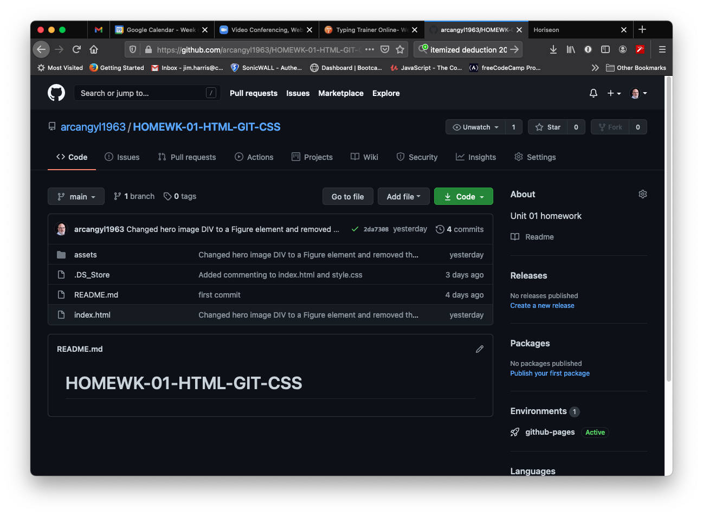

# HOMEWK-01-HTML-GIT-CSS

## Description

Keeping the client requests in mind and the content that was already in place in the web application was key for this assignment. The web application was modified with a more accessible code base as requested by the client. By adding semantic elements the code is more readable and manageable and should ease the process of any future modifications.
All CSS styles were updated and consolidated for cleaner functionality and ease of manageability.

## Installation

My files can be accessed in the repository [HERE](https://github.com/arcangyl1963/HOMEWK-01-HTML-GIT-CSS)
The image below shows the repository where my project files are located:

The web application can be viewed [HERE](https://arcangyl1963.github.io/HOMEWK-01-HTML-GIT-CSS/).

The image below shows the updated web page layout remains unchanged with the modifications to the code: 

© 2021 arcangyl studios